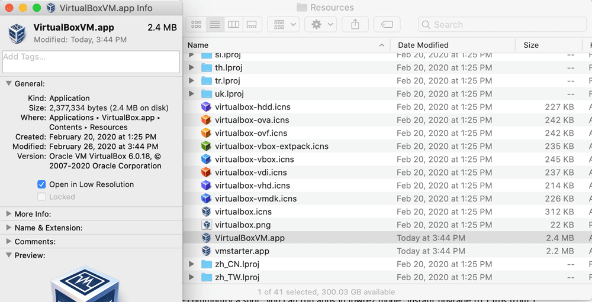

# Make it work smoothly on macOS retina display

VirtualBox VMs are mostly unusable when running in high resolution displays on macOS. 

To prevent massive UI slowdown, enable a flag thath tell macOS to run the VMs in low reslution

# References
- https://www.virtualbox.org/ticket/11606?cversion=0&cnum_hist=6
- https://forums.virtualbox.org/viewtopic.php?p=470879#p470879
